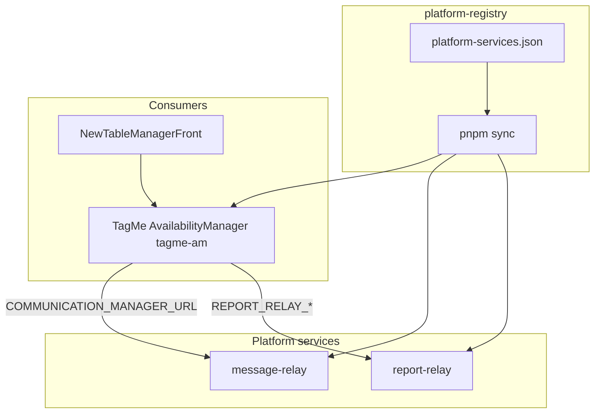

# Platform ecosystem — start guide

Single entry point before writing code. Review this, then pick **one issue** from the table below.

## Architecture (three layers)



| Layer | Repo | Own DB? | Role |
|-------|------|---------|------|
| **Registry** | [platform-registry](https://github.com/renatogabrielbr/platform-registry) | No | Contracts, env keys, filter fields, doc sync |
| **report-relay** | [report-relay](https://github.com/renatogabrielbr/report-relay) | **Yes** Postgres | Async CSV/XLSX exports |
| **message-relay** | [message-relay](https://github.com/renatogabrielbr/message-relay) | Mongo + Redis | SMS / email / WhatsApp delivery |
| **TagMe AM** | AvailabilityManager (local `refactor/ascom`) | Yes | Business logic, RBAC, venue webhooks |

**Rule:** Venue **client webhooks** → AM. Provider **delivery** → message-relay. **Exports** → report-relay.

---

## All GitHub milestones & issues

### platform-registry — [milestone #1](https://github.com/renatogabrielbr/platform-registry/milestone/1)

| Issue | Task | Status |
|-------|------|--------|
| [#1](https://github.com/renatogabrielbr/platform-registry/issues/1) | P0 — Registry bootstrap | ✅ docs done |
| [#2](https://github.com/renatogabrielbr/platform-registry/issues/2) | P1 — Sync hardening | **Start here (registry track)** |
| [#3](https://github.com/renatogabrielbr/platform-registry/issues/3) | P2 — JSON Schema validation | |
| [#4](https://github.com/renatogabrielbr/platform-registry/issues/4) | P3 — Waitlist consumer entry | |
| [#5](https://github.com/renatogabrielbr/platform-registry/issues/5) | P4 — CI drift check | |

### report-relay — [milestone #1](https://github.com/renatogabrielbr/report-relay/milestone/1)

| Issue | Task | Status |
|-------|------|--------|
| [#1](https://github.com/renatogabrielbr/report-relay/issues/1) | R0 — Go scaffold + Docker Compose | **Start here (reports track)** |
| [#2](https://github.com/renatogabrielbr/report-relay/issues/2) | R1 — Own Postgres + job API | |
| [#3](https://github.com/renatogabrielbr/report-relay/issues/3) | R2 — Connectors | |
| [#4](https://github.com/renatogabrielbr/report-relay/issues/4) | R3 — Export + blob | |
| [#5](https://github.com/renatogabrielbr/report-relay/issues/5) | R4 — TagMe reservations.export | needs AM local proxy |
| [#6](https://github.com/renatogabrielbr/report-relay/issues/6) | R5 — Multi-tenant admin | |

### message-relay — [milestone #1](https://github.com/renatogabrielbr/message-relay/milestone/1)

| Issue | Task | Status |
|-------|------|--------|
| [#1](https://github.com/renatogabrielbr/message-relay/issues/1) | G0 — Go scaffold + Dockerfile | **Start here (comms track)** |
| [#2](https://github.com/renatogabrielbr/message-relay/issues/2) | WAF — Legacy lockdown (ops) | parallel |
| [#3](https://github.com/renatogabrielbr/message-relay/issues/3) | G1 — Auth + antifraud | |
| [#4](https://github.com/renatogabrielbr/message-relay/issues/4) | G2 — Send routes + adapters | |
| [#5](https://github.com/renatogabrielbr/message-relay/issues/5) | G3 — Webhooks + Asynq | |
| [#6](https://github.com/renatogabrielbr/message-relay/issues/6) | G4 — AM staging cutover | needs AM env |
| [#7](https://github.com/renatogabrielbr/message-relay/issues/7) | G5 — Kill Legacy | |

### AvailabilityManager (local only — no GitHub issues)

| Commit | Topic |
|--------|--------|
| `0bd9eb87` | Report-relay integration docs |
| `cfac1a88` | Venue-integration + comms hooks |

Branch: `refactor/ascom` — **not pushed**.

---

## Doc map (what to read)

| Doc | Repo | Purpose |
|-----|------|---------|
| [ecosystem-start.md](./ecosystem-start.md) | platform-registry | **This file** |
| [roadmap.md](./roadmap.md) | platform-registry | P0–P4 |
| [registry/platform-services.json](../registry/platform-services.json) | platform-registry | Single key file |
| [proposal.md](https://github.com/renatogabrielbr/report-relay/blob/main/docs/proposal.md) | report-relay | Report platform design |
| [proposal-go-v3.md](https://github.com/renatogabrielbr/message-relay/blob/main/docs/proposal-go-v3.md) | message-relay | Comms platform design |
| [reports/am-integration.md](https://github.com/tagmefoodsolutions/AvailabilityManager/blob/main/docs/reports/am-integration.md) | AM (local) | Report cutover plan |
| [venue-integration-alerts.md](https://github.com/tagmefoodsolutions/AvailabilityManager/blob/main/docs/venue-integration-alerts.md) | AM (local) | Webhooks vs message-relay |

Generated stubs (run `pnpm sync`):

- `report-relay/docs/consumers/tagme-am.md`
- `message-relay/docs/consumers/tagme-am.md`

---

## Doc review notes (2026-06)

| Check | Result |
|-------|--------|
| Registry owned by neutral repo | ✅ `platform-registry` |
| TagMe = consumer `tagme-am`, not hub | ✅ |
| report-relay issues match roadmap R0–R5 | ✅ 6 issues + labels |
| message-relay issues match roadmap G0–G5 + WAF | ✅ 7 issues |
| Filter contract single source | ✅ JSON → sync → AM markers |
| report-relay has Go code | ❌ **R0 not started** — docs only |
| message-relay has Go code | ❌ **G0 not started** — docs only |
| platform-registry CI | ❌ P4 not done |
| message-relay issue labels | ⚠️ missing (report-relay has `phase/*`) |
| AM on GitHub | ⚠️ integration docs local only until push |

---

## Workspace setup

```powershell
$env:PLATFORM_WORKSPACE_ROOT = "C:\Users\renato\workspace"

# After editing registry JSON:
cd C:\Users\renato\workspace\projects\platform-registry
pnpm sync
```

---

## Suggested first sprint (2 devs)

| Dev | Week 1 | Week 2 |
|-----|--------|--------|
| A | report-relay **#1 R0** + **#2 R1** | **#3 R2** connectors |
| B | message-relay **#1 G0** + **#3 G1** | **#4 G2** send routes |
| Either | platform-registry **#2 P1** sync hardening | |

AM wiring waits until report-relay **#4** and message-relay **#4–#6**.
