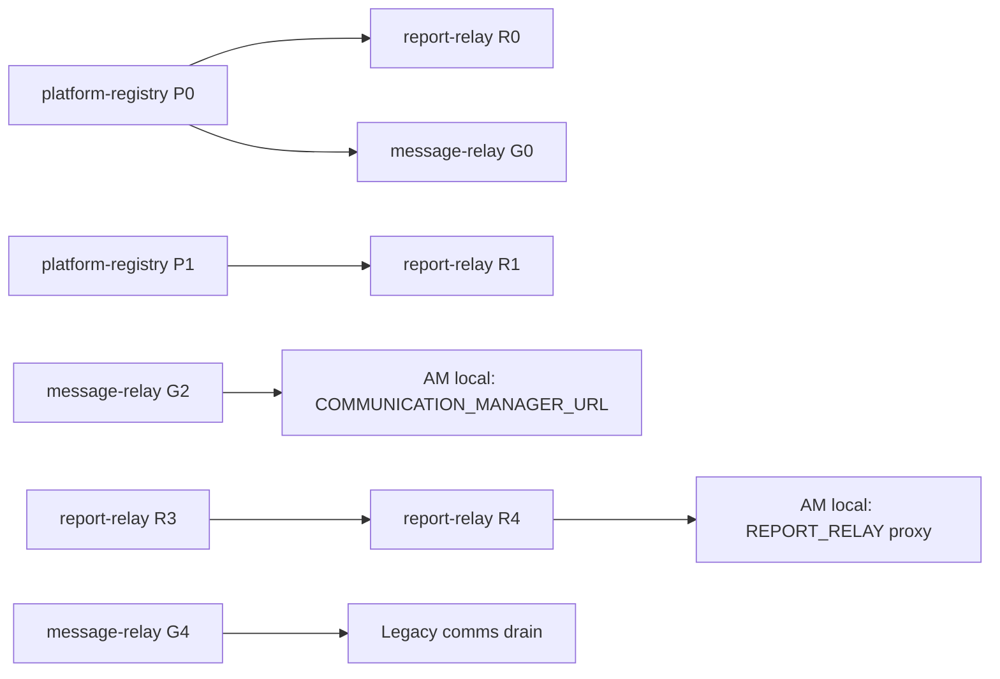

# Roadmap — platform-registry

**Milestone:** [Platform Registry v1](https://github.com/renatogabrielbr/platform-registry/milestone/1)  
**Goal:** Single neutral contract hub for all platform services and their consumers.

## Phases

| Phase | Duration | GitHub issue | Deliverable |
|-------|----------|--------------|-------------|
| **P0** | done | [#1](https://github.com/renatogabrielbr/platform-registry/issues/1) | Registry JSON, sync script, docs, GitHub tasks |
| **P1** | 1 week | [#2](https://github.com/renatogabrielbr/platform-registry/issues/2) | Sync validation, `--dry-run`, path checks, exit codes |
| **P2** | 1 week | [#3](https://github.com/renatogabrielbr/platform-registry/issues/3) | JSON Schema for `platform-services.json` + CI validate |
| **P3** | 1 week | [#4](https://github.com/renatogabrielbr/platform-registry/issues/4) | Add waitlist consumer + cross-link widget proposal |
| **P4** | 1 week | [#5](https://github.com/renatogabrielbr/platform-registry/issues/5) | GitHub Action: fail PR if generated stubs drift |

## Downstream services (separate repos)

| Service | Milestone | Start issue |
|---------|-----------|-------------|
| [report-relay](https://github.com/renatogabrielbr/report-relay/milestone/1) | Report Relay Platform v1 | [R0 #1](https://github.com/renatogabrielbr/report-relay/issues/1) |
| [message-relay](https://github.com/renatogabrielbr/message-relay/milestone/1) | Communications Go Greenfield | [G0 #1](https://github.com/renatogabrielbr/message-relay/issues/1) |

## Recommended start order

1. **platform-registry P1** — harden sync (parallel with R0/G0)
2. **report-relay R0 → R1** — scaffold + own DB
3. **message-relay G0 → G1** — scaffold + auth (parallel track)
4. **AM local** — venue-integration already committed; wire env when G2/R4 ready

## Labels

| Label | Use |
|-------|-----|
| `phase/p0` … `phase/p4` | Registry roadmap |
| `type/feature` | Capability |
| `type/docs` | Documentation |
| `type/infra` | CI, validation |
| `area/sync` | sync-consumer-docs.mjs |
| `area/schema` | JSON Schema |
| `priority/high` | Blocking |

## Related specs

- [issues/p0-bootstrap.md](./issues/p0-bootstrap.md)
- [issues/p1-sync-hardening.md](./issues/p1-sync-hardening.md)
- [issues/p2-schema-validation.md](./issues/p2-schema-validation.md)
- [issues/p3-waitlist-consumer.md](./issues/p3-waitlist-consumer.md)
- [issues/p4-ci-drift-check.md](./issues/p4-ci-drift-check.md)
- [ecosystem-start.md](./ecosystem-start.md) — **master start guide**
